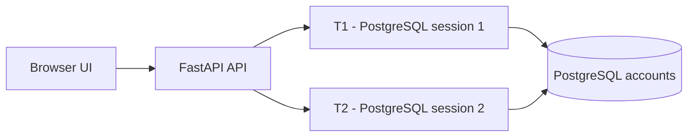
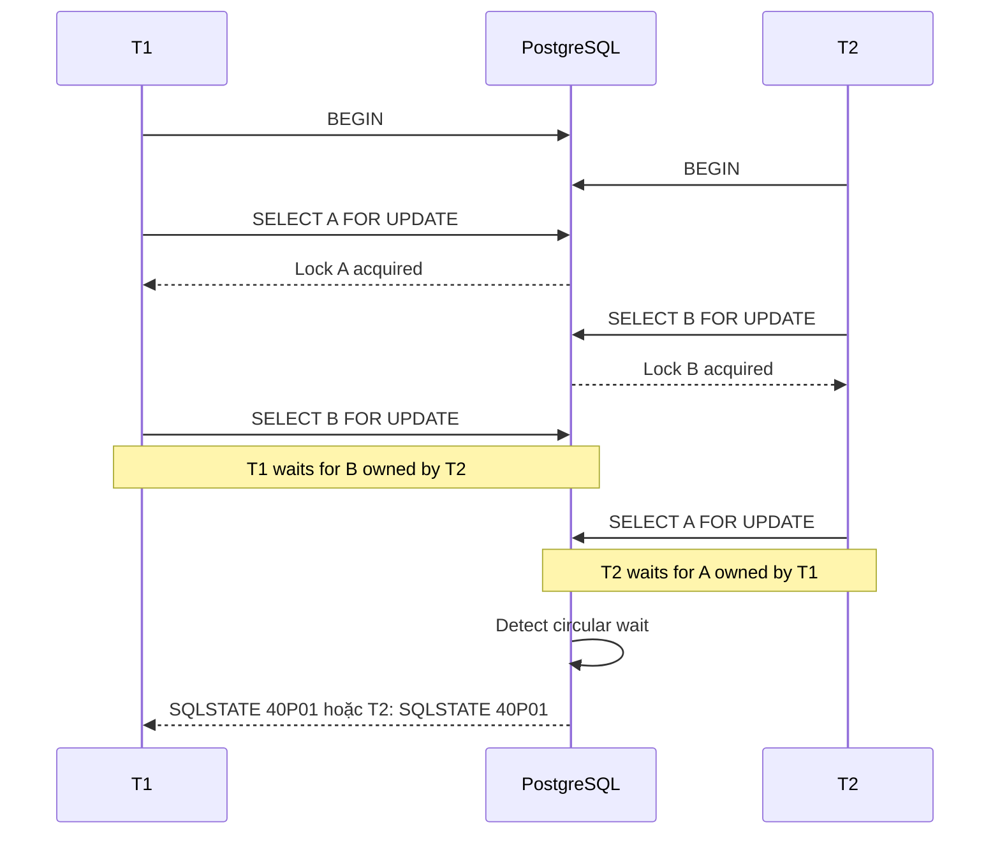
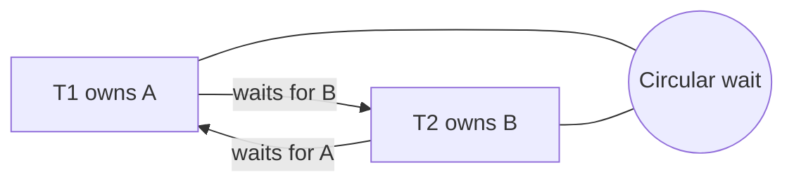
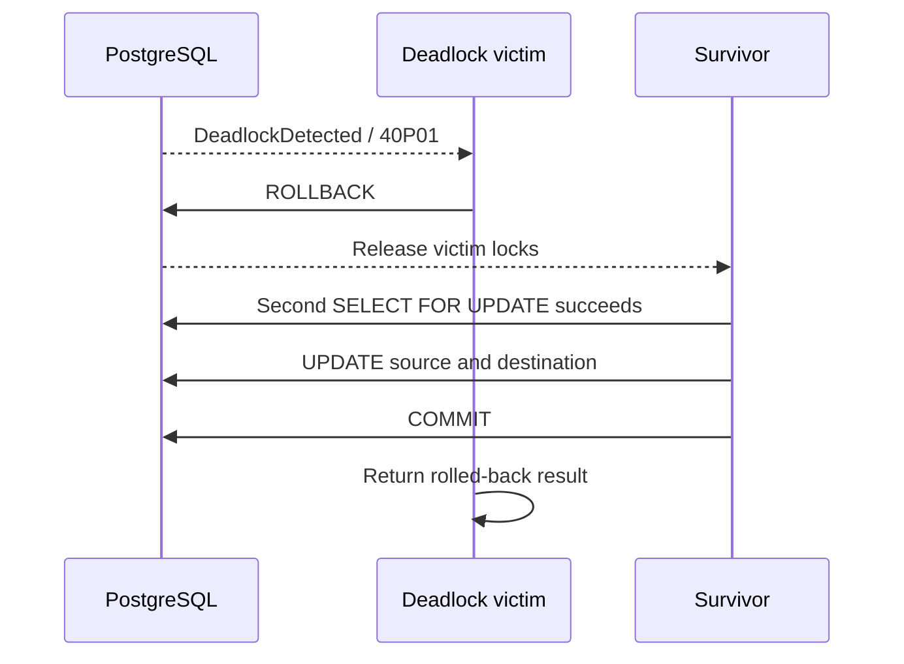
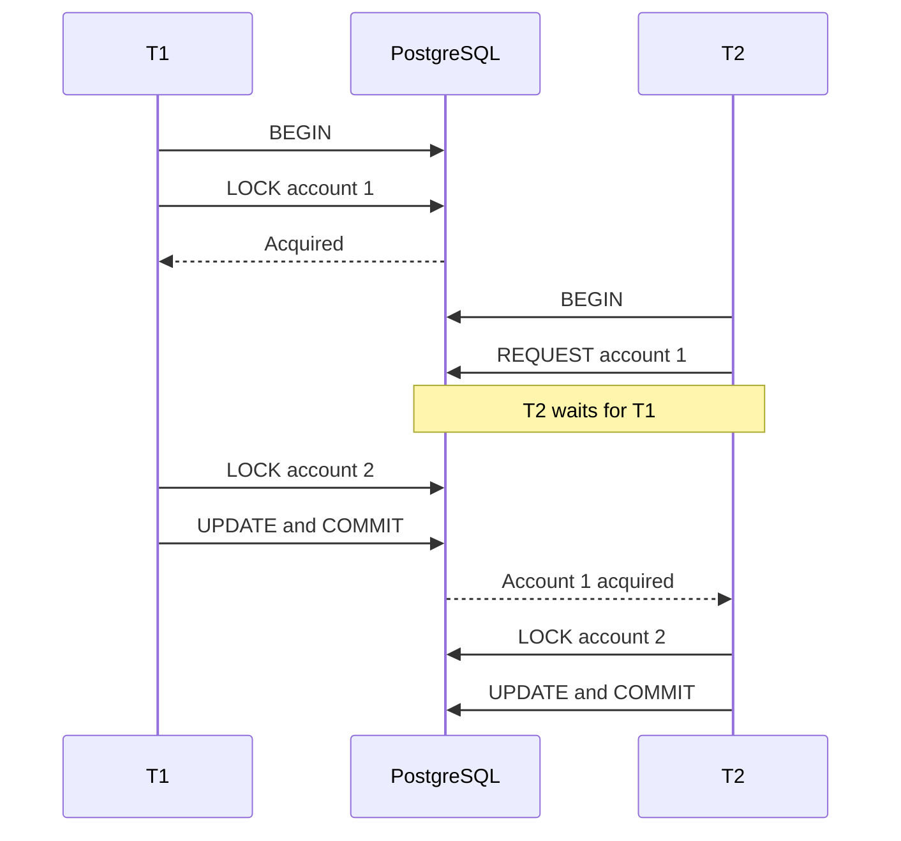
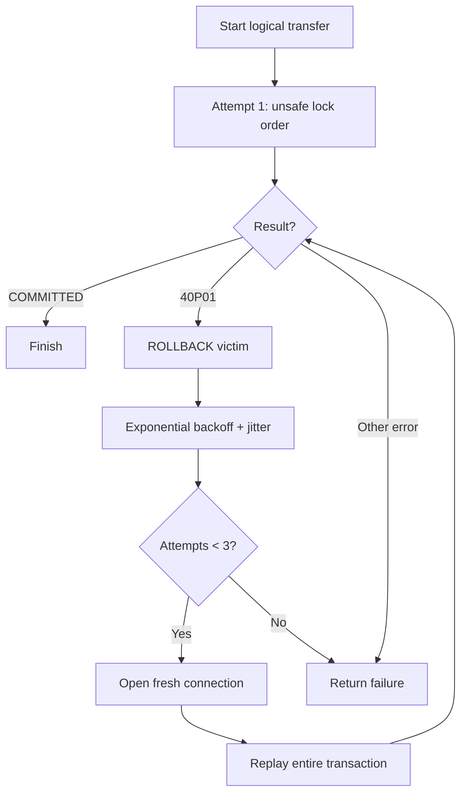
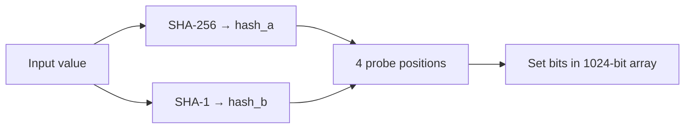
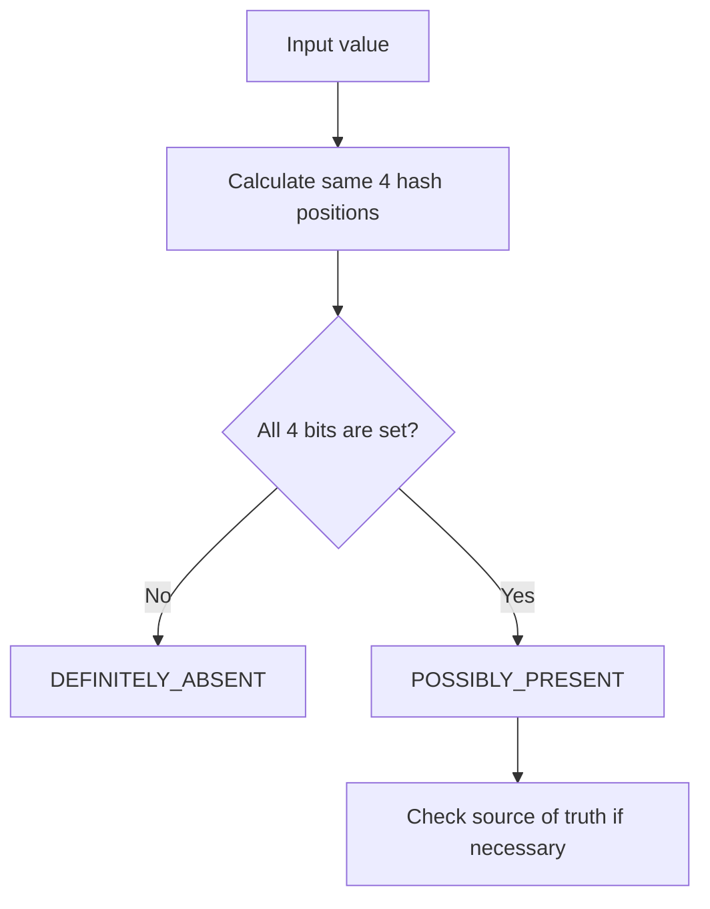
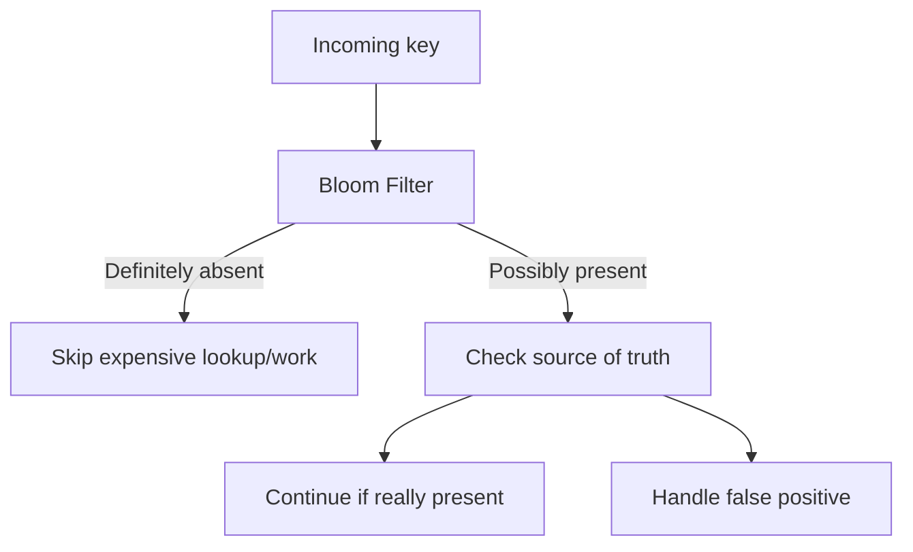

# PostgreSQL Deadlock & Bloom Filter

## Mục tiêu bài trình bày

Sau phần demo, người nghe có thể:

- giải thích deadlock khác lock wait như thế nào;
- mô tả cách PostgreSQL phát hiện và resolve deadlock;
- phân biệt prevention bằng lock ordering với recovery bằng retry;
- hiểu Bloom Filter dùng bit array và nhiều hash function để kiểm tra membership;
- biết vì sao Bloom Filter không có false negative nhưng có thể có false positive;
- nhận diện các use case thực tế của Bloom Filter.

---

## 1. Bối cảnh hệ thống



Điểm quan trọng: T1 và T2 phải dùng **hai PostgreSQL connection độc lập**. Nếu chạy cả hai transaction trên cùng một connection thì không tạo ra concurrency thật và không tái hiện được deadlock giữa các session.

Database có hai account:

```text
Account A: id=1, balance=1000
Account B: id=2, balance=1000
Total:     2000
```

Invariant sau mỗi demo thành công:

```text
SUM(accounts.balance) = 2000
```

---

## 2. Deadlock là gì?

Deadlock xảy ra khi nhiều transaction chờ lẫn nhau theo một vòng tròn. Không transaction nào có thể tiếp tục nếu không có một transaction bị rollback.

Ví dụ trong lab:

```text
T1: Account A → Account B, amount=100
T2: Account B → Account A, amount=200
```

### Trình tự tạo deadlock



### Wait-for graph



`asyncio.Event` trong backend chỉ dùng để đảm bảo hai first lock đã tồn tại trước khi request second lock. Deadlock thực tế được tạo bởi PostgreSQL `SELECT ... FOR UPDATE`, không phải bởi exception giả lập trong Python.

### PostgreSQL làm gì?

PostgreSQL có deadlock detector. Khi phát hiện cycle, PostgreSQL chọn một transaction làm victim và abort transaction đó.

```text
Deadlock detected
        ↓
Victim nhận SQLSTATE 40P01
        ↓
Victim transaction bị abort
        ↓
Application rollback/close victim connection
        ↓
Transaction còn lại lấy được lock và tiếp tục
```

Không được giả định victim luôn là T1 hoặc T2. PostgreSQL quyết định dựa trên trạng thái thực tế của các session.

---

## 3. Resolve deadlock bằng rollback victim



### Kết quả deadlock mode

```text
deadlock_detected = true
Một transaction: COMMITTED
Một transaction: ROLLED_BACK, sqlstate=40P01
total_balance = 2000
invariant_ok = true
```

Individual balances phụ thuộc victim:

```text
Nếu T1 commit: A=900,  B=1100
Nếu T2 commit: A=1200, B=800
```

Tổng tiền vẫn là `2000` vì mỗi transaction cập nhật source và destination trong cùng một transaction boundary.

### Demo command

```powershell
Invoke-RestMethod -Method Post http://localhost:8000/api/demo/deadlock |
    ConvertTo-Json -Depth 8
```

Hoặc:

```bash
curl -X POST http://localhost:8000/api/demo/deadlock
```

---

## 4. Prevention: consistent lock ordering

Resolve sau khi deadlock xảy ra là recovery. Cách tốt hơn là ngăn cycle ngay từ đầu.

Rule của safe-ordering mode:

```text
Mọi transaction luôn lock account ID nhỏ hơn trước.

T1: lock 1 → lock 2
T2: lock 1 → lock 2
```

### Lock wait nhưng không deadlock



```text
Lock wait != Deadlock

Wait một chiều: T2 → T1        Có thể giải phóng sau COMMIT
Circular wait: T1 ↔ T2        Cần abort một transaction
```

### Kết quả safe-ordering mode

```text
deadlock_detected = false
T1 = COMMITTED
T2 = COMMITTED
A = 1100
B = 900
Total = 2000
```

### Demo command

```bash
curl -X POST http://localhost:8000/api/demo/safe-ordering
```

---

## 5. Recovery: bounded retry cho SQLSTATE 40P01

Deadlock có thể vẫn xuất hiện trong hệ thống phức tạp. Khi operation retry-safe, application có thể retry **toàn bộ transaction**, không chỉ câu SQL bị lỗi.



Retry rules:

- chỉ retry SQLSTATE `40P01`;
- rollback trước khi retry;
- dùng connection mới;
- retry toàn bộ logical transaction;
- backoff có exponential growth và random jitter;
- giới hạn tối đa `3` attempts;
- không retry vô hạn hoặc retry lỗi nghiệp vụ khác.

### Kết quả retry mode

```text
Attempt 1: một transaction nhận 40P01 và rollback
Attempt 2: victim replay thành công
Final: cả hai logical transfer COMMITTED
A = 1100
B = 900
Total = 2000
```

### Demo command

```bash
curl -X POST http://localhost:8000/api/demo/retry
```

---

## 6. Bloom Filter hoạt động như thế nào?

Bloom Filter là một cấu trúc dữ liệu probabilistic dùng để trả lời câu hỏi:

```text
"Giá trị này có thể đã xuất hiện chưa?"
```

Trong demo:

```text
bit_size   = 1024 bits
hash_count = 4
storage    = bytearray
```

### Luồng insert



Các vị trí được tạo bằng double hashing:

```text
position_i = (hash_a + i × hash_b) mod bit_size
```

Với `hash_count=4`, mỗi value set bốn bit trong bit array.

### Luồng lookup



### Hai guarantee quan trọng

| Bloom Filter result | Ý nghĩa |
| --- | --- |
| `False` | Chắc chắn value chưa được insert |
| `True` | Có thể value đã được insert; có thể false positive |
| Inserted value | Không được trở thành false negative |

Bloom Filter không thể tự kết luận chắc chắn rằng một value **đã tồn tại**. Khi result là `True`, application vẫn cần kiểm tra cache/database/source of truth nếu correctness quan trọng.

### Ví dụ trực quan

Giả sử filter nhỏ có 16 bit và 3 hash functions:

```text
Ban đầu:
0 0 0 0 0 0 0 0 0 0 0 0 0 0 0 0
```

Insert `alice@example.com`, hash ra các vị trí `2, 7, 11`:

```text
0 0 1 0 0 0 0 1 0 0 0 1 0 0 0 0
```

Lookup một value khác cũng cần các vị trí `2, 7, 11`:

```text
All bits set → POSSIBLY_PRESENT
```

Nhưng các bit đó có thể đã được set bởi nhiều value khác nhau. Đây là nguồn gốc của false positive.

Nếu chỉ cần một trong các bit chưa được set:

```text
Một bit = 0 → DEFINITELY_ABSENT
```

### False positive tăng như thế nào?

Estimated false-positive rate của demo:

```text
(1 - e^(-k × n / m))^k

m = bit_size
k = số hash functions
n = số inserted items
```

Với demo hiện tại:

```text
m = 1024
k = 4
n = 5
Estimated FPR ≈ 1.40e-5%
```

Khi `n` tăng nhưng `m` giữ nguyên, nhiều bit bị set hơn và xác suất false positive tăng.

### Demo command

```bash
curl -X POST http://localhost:8000/api/demo/bloom-filter
```

Response minh họa:

```json
{
  "mode": "bloom-filter",
  "bit_size": 1024,
  "hash_count": 4,
  "checks": [
    {
      "value": "alice@example.com",
      "inserted": true,
      "maybe_present": true,
      "interpretation": "POSSIBLY_PRESENT"
    },
    {
      "value": "carol@example.com",
      "inserted": false,
      "maybe_present": false,
      "interpretation": "DEFINITELY_ABSENT"
    }
  ]
}
```

---

## 7. Ứng dụng thực tế của Bloom Filter



### Cache/database lookup guard

```text
Bloom says DEFINITELY_ABSENT
        ↓
Không cần query cache/database cho key này
```

Dùng khi phần lớn request là miss và database lookup đắt hơn một vài phép hash.

### Duplicate detection

Các hệ thống ingest/crawl có thể dùng Bloom Filter để kiểm tra nhanh:

- email đã thấy chưa;
- URL đã crawl chưa;
- content hash đã xử lý chưa;
- event ID đã nhận chưa.

Nếu Bloom trả `POSSIBLY_PRESENT`, vẫn kiểm tra storage thật trước khi bỏ qua dữ liệu.

### Rate-limit hoặc abuse pre-check

Bloom Filter có thể làm lớp lọc rẻ trước hệ thống rate-limit đầy đủ:

```text
Unknown key → giảm một phần chi phí lookup
Possible key → chuyển sang counter/store chính xác
```

Bloom Filter không thay thế rate limiter chính xác vì nó không hỗ trợ counter theo thời gian và có false positive.

### Trade-off

| Ưu điểm | Hạn chế |
| --- | --- |
| Ít memory | Có false positive |
| Lookup nhanh | Không hỗ trợ delete trong bản cơ bản |
| Không có false negative | Cần source of truth sau positive |
| Phù hợp read-heavy workload | Cần sizing theo số item và FPR |

---

## 8. So sánh hai demo

| Chủ đề | PostgreSQL Deadlock | Bloom Filter |
| --- | --- | --- |
| Loại vấn đề | Concurrency/resource coordination | Probabilistic membership |
| State chính | Row locks trong PostgreSQL | Bit array trong memory |
| Kết quả | Commit, rollback, SQLSTATE | Definitely absent / possibly present |
| Cách xử lý | Lock ordering, rollback, retry | Chọn kích thước/hash và check source of truth |
| Rủi ro chính | Circular wait | False positive |
| Invariant | Tổng balance vẫn bằng 2000 | Inserted values không false negative |

---

## 9. Kịch bản thuyết trình đề xuất

### Slide 1 — Vấn đề

> Hai transaction cùng cập nhật hai account nhưng lấy lock theo thứ tự ngược nhau.

### Slide 2 — Deadlock xảy ra

Chạy `/api/demo/deadlock`, chỉ vào wait-for graph và event `DEADLOCK_DETECTED`.

### Slide 3 — PostgreSQL resolve

Giải thích `40P01`, rollback victim và survivor tiếp tục.

### Slide 4 — Prevent bằng ordering

Chạy `/api/demo/safe-ordering`, nhấn mạnh lock wait một chiều không phải deadlock.

### Slide 5 — Recover bằng retry

Chạy `/api/demo/retry`, chỉ vào `RETRY_SCHEDULED`, `RETRY_STARTED` và final invariant.

### Slide 6 — Bloom Filter

Chạy `/api/demo/bloom-filter`, giải thích bit array, bốn hash probes và hai loại kết luận.

### Slide 7 — Ứng dụng và trade-off

Kết thúc bằng cache guard, duplicate detection, URL/email check, rate-limit pre-check và false-positive trade-off.

---

## 10. Key takeaways

```text
Deadlock:
  Prevention = lock resources in a consistent order.
  Recovery   = rollback victim and retry the whole transaction safely.

Bloom Filter:
  False      = definitely absent.
  True       = possibly present.
  Positive   = still verify with the source of truth.
```

